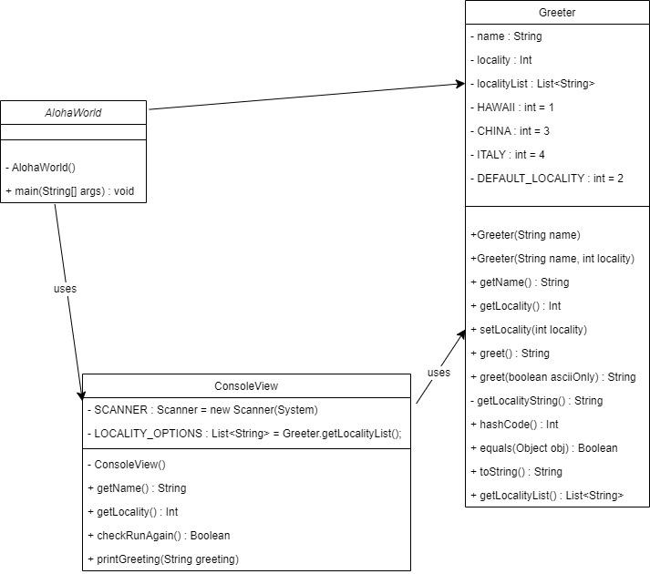

# Homework Aloha World Report

The following report contains questions you need to answer as part of your submission for the homework assignment. 

## Design Doc
Please link your UML design file here. See resources in the assignment on how to
link an image in markdown. You may also use [mermaid] class diagrams if you prefer, if so, include the mermaid code here.  You DO NOT have to include Greeting.java as part of the diagram, just the AlohaWorld application that includes: [AlohaWorld.java], [Greeter.java], and [ConsoleView.java].

### Program Flow
Write a short paragraph detailing the flow of the program in your own words. This is to help you understand / trace the code (and give you practice of something called a code walk that will be required in this course).

The AlohaWorld class is what is considered a driver. It "drives" the program, meaning it is where you run the program. ConsoleView is what gets the input from the user. It is able to get the name of the user, the locality, check if it needs to run again, and print the greeting. Greeter is where the program is able to take the inputs and do something with them. It has all the getters ConsoleView has, as well as ones for the Locality String and list. It is able to put together the greetings for the console.

## Assignment Questions

1. List three additional java syntax items you didn't know when reading the code.  (make sure to use * for the list items, see example below, the backtick marks are used to write code inline with markdown)
   
   * final class
   * static
   * instanceof

2. For each syntax additional item listed above, explain what it does in your own words and then link a resource where you figured out what it does in the references section. 

    * Final means that either a variable, class, or method is not able to be changed after its initialization. A method can't be overridden and a class can't be extended.[^1]
    * Static means that able to be accessed within all instances within the class. It is helpful for memory allocation. [^2]
    * instanceof checks if a variable has a specific object within it. It returns true if it does, otherwise it will return false. [^3]

3. What does `main` do in Java? 

    The main is what is used to start the program, as said in the AlohaWorld docstring. Generally in my experience it is best to have as minimal code within the main if possible. The program will not run if there is no main method, as it is what drives the program.[^4]

4. What does `toString()` do in Java? Why should any object class you create have a `toString()` method?

    ToString() is important because it creates an easily readable output for your object class. It simplifies and creates a reusable string to print for outputs. [^5] It is also helpful for testing, as the programmer can check if the program is taking in the variable correctly.

5. What is javadoc style commenting? What is it used for? 

    As said in the Javadoc comment in AlohaWorld, Javadoc style commenting is for writing longer comments before methods, classes, and global variables. It is also able to help generate the javadoc documentation.

6. Describe Test Driving Development (TDD) in your own words. 

    Test Driving Development is creating tests for every method in your classes. Instead of testing a bunch of inputs within the code or terminal, the programmer can create tests to easily run which coding.

7. Go to the [Markdown Playground](MarkdownPlayground.md) and add at least 3 different markdown elements you learned about by reading the markdown resources listed in the document. Additionally you need to add a mermaid class diagram (of your choice does not have to follow the assignment. However, if you did use mermaid for the assignment, you can just copy that there). Add the elements into the markdown file, so that the formatting changes are reserved to that file.

## Deeper Thinking Questions

These questions require deeper thinking of the topic. We don't expect 100% correct answers, but we encourage you to think deeply and come up with a reasonable answer. 

1. Why would we want to keep interaction with the client contained to ConsoleView?
   Keeping interaction with the client contained within one class, ConsoleView, is important because a program can only be run in one place.

2. Right now, the application isn't very dynamic in that it can be difficult to add new languages and greetings without modifying the code every time. Just thinking programmatically,  how could you make the application more dynamic? You are free to reference Geeting.java and how that could be used in your design.
   A potential way to make the application more dynamic is to create a separate languages class. This would make it easier to add more languages.

> [!IMPORTANT]
>  After you upload the files to your github (ideally you have been committing throughout this progress / after you answer every question) - make sure to look at your completed assignment on github/in the browser! You can make sure images are showing up/formatting is correct, etc. The TAs will actually look at your assignment on github, so it is important that it is formatted correctly.

## References

[^1]: Final keyword in Java: 2024. https://www.geeksforgeeks.org/final-keyword-in-java/. Accessed: 2025-01-27. 

[^2]: static keyword in Java: 2025. https://www.geeksforgeeks.org/static-keyword-java/. Accessed: 2025-01-27.

[^3]: instanceof keyword in Java: 2023. https://www.geeksforgeeks.org/instanceof-keyword-in-java/. Accessed: 2025-01-27.

[^4]: Java main() Method – public static void main(String[] args): 2024. https://www.geeksforgeeks.org/java-main-method-public-static-void-main-string-args/. Accessed: 2025-01-27.

[^5]: Java toString() Method: https://www.javatpoint.com/understanding-toString()-method. Accessed 2025-01-27

<!-- This is a comment, below this link the links in the document are placed here to make ti easier to read. This is an optional style for markdown, and often as a student you will include the links inline. for example [mermaid](https://mermaid.js.org/intro/syntax-reference.html) -->
[mermaid]: https://mermaid.js.org/intro/syntax-reference.html
[AlohaWorld.java]: src/main/java/student/AlohaWorld.java
[Greeter.java]: src/main/java/student/Greeter.java
[ConsoleView.java]: src/main/java/student/ConsoleView.java